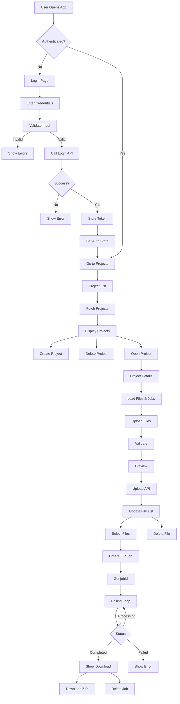

# File Processing System

This is a file processing system that demonstrates various operations on files.

## System Architecture

```mermaid
    flowchart TD

%% AUTH FLOW
A[User Opens App] --> B{Authenticated?}

B -- No --> C[Login Page]
C --> D[Enter Credentials]
D --> E[Validate Input]

E -- Invalid --> F[Show Errors]
E -- Valid --> G[Call Login API]

G --> H{Success?}
H -- No --> I[Show Error]
H -- Yes --> J[Store Token]

J --> K[Set Auth State]
K --> L[Go to Projects]

B -- Yes --> L

%% PROJECT FLOW
L --> M[Project List]
M --> N[Fetch Projects]
N --> O[Display Projects]

O --> P[Create Project]
O --> Q[Delete Project]
O --> R[Open Project]

%% DETAILS
R --> S[Project Details]
S --> T[Load Files & Jobs]

%% FILE FLOW
T --> U[Upload Files]
U --> V[Validate]
V --> W[Preview]
W --> X[Upload API]
X --> Y[Update File List]

Y --> Z[Select Files]

%% ZIP FLOW
Z --> AA[Create ZIP Job]
AA --> AB[Get jobId]
AB --> AC[Polling Loop]

AC --> AD{Status}
AD -- Processing --> AC
AD -- Completed --> AE[Show Download]
AD -- Failed --> AF[Show Error]

AE --> AG[Download ZIP]

%% DELETE
AE --> AH[Delete Job]
Y --> AI[Delete File]
```
