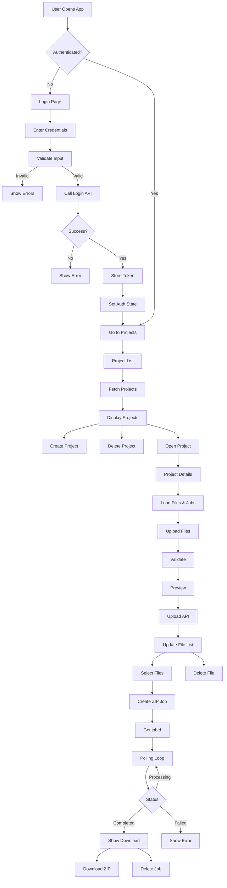

```markdown
# File Management and ZIP Job System

React and TypeScript application designed for managing projects, handling multi-file uploads, and generating downloadable ZIP archives asynchronously through a job-based polling system.

## Features

### Project Management

- **Operations**: Create, view, and delete projects
- **Dashboard**: Paginated project listing with metadata including file counts, job counts, and timestamps

### File Management

- **Advanced Upload**: Drag and drop support with multi-file upload capabilities
- **Validation**: Pre-upload file validation for size limits and type restrictions
- **Preview**: Visual file preview before committing to upload

### ZIP Job System

- **Asynchronous Processing**: Select specific files to initiate a ZIP compression job
- **Real-time Tracking**: Progress tracking via an automated polling mechanism
- **Management**: Download completed archives or delete job history

### Authentication

- **Security**: Token-based authentication with protected routing
- **Persistence**: Session persistence via localStorage
- **Interceptors**: Automated header injection via Axios interceptors

## 🛠 Tech Stack

| Category     | Technology                     |
| ------------ | ------------------------------ |
| **Frontend** | React 19 + TypeScript          |
| **State**    | useReducer + Context API       |
| **Routing**  | React Router                   |
| **HTTP**     | Axios                          |
| **Styling**  | CSS Modules                    |
| **Testing**  | Vitest + React Testing Library |

## Folder Structure
```

```
src/
├── assets/ # Images/icons
├── auth/ # Auth guards
├── components/ # UI components
├── context/ # State providers
├── hooks/ # Custom hooks
├── models/ # TypeScript types
├── pages/ # Page components
├── reducers/ # State logic
└── services/ # API layer

```

## Installation & Setup

```bash
# 1. Clone & Install
git clone https://github.com/rishab-mindfire/File-Processing-System
cd File-Processing-System
npm install

# 2. Environment (.env)
echo "VITE_BASE_URL=http://localhost:5000/api" > .env

# 3. Run
npm run dev
```

## System Workflows

```
Authentication: Login → JWT Token → localStorage → Axios Interceptor → Protected Routes
ZIP Jobs: Select Files → Create Job → jobId → Poll → 100% → Download Link get
```

## Scripts

| Command         | Description        |
| --------------- | ------------------ |
| `npm run dev`   | Development server |
| `npm run build` | Production build   |
| `npm run test`  | Run tests          |

## Testing

```bash
npm run test      # All tests
```

| Category     | Technology                     |
| ------------ | ------------------------------ |
| **Frontend** | React 19 + TypeScript          |
| **State**    | useReducer + Context API       |
| **Routing**  | React Router                   |
| **HTTP**     | Axios                          |
| **Styling**  | CSS Modules                    |
| **Testing**  | Vitest + React Testing Library |

## System Architecture


